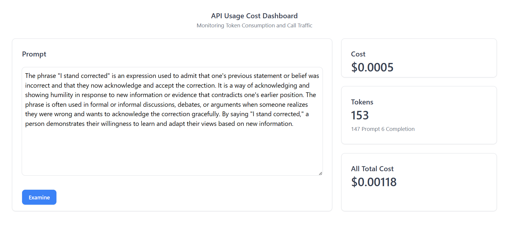

# Building an OpenAI API Tokens Usage Dashboard: A GridDB, Node.js, and React Approach

## Introduction

Organizations rely on advanced APIs like OpenAI API to enhance their applications. These APIs enable interaction with AI and machine learning models. However, managing API tokens, which determine the cost of API calls, can be challenging. Over-usage leads to high costs, while under-usage wastes resources.

To address this challenge, a real-time token usage dashboard is proposed. It leverages GridDB for data management, Node.js for backend development, and React for the front-end UI. This document aims to provide a guide for understanding the problem, conceptualizing the solution, and implementing it effectively with the chosen technologies.

## Purpose of this Blog

The primary purpose of this document is to provide a thorough and systematic guide to building an OpenAI API Tokens Usage Dashboard using GridDB, Node.js, and React.

## Setup and Running

Clone the source code from the [GitHub](https://github.com/junwatu/openai-tokens-dashboard) repository:

```shell
git clone https://github.com/junwatu/openai-tokens-dashboard.git
```

> Make sure you have installed GridDB and Node.js LTS 18.
> If you don't have it, please go to the [**Installation**](/#installation) section in this blog post.

Change the directory to the `openai-tokens-dashboard` folder, then create or edit the `.env` file.

You should have access to the OpenAI API. [Create a key](https://platform.openai.com/account/api-keys) and then set the OpenAI API key that you have created into the `OPENAI_API_KEY` environment variable:

```ini
OPENAI_API_KEY=put_your_key_here
```

Install all the npm dependencies in the root project, `server` directory, and `ui` directory:

```sh
cd openai-tokens-dashboard
npm install

cd server
npm install

cd ../ui
npm install
```

Change the directory to `server`, and then run the dashboard server:

```sh
cd server
npm run start
```

Open another terminal and change the directory from the root project to the `ui` directory, then run the dashboard UI development:

```sh
cd ui
npm run dev
```

If the server and client are running, open the browser and navigate to `http://localhost:5173`.


If everything is running smoothly, you will see the web user interface as shown in the screenshot above.

## Deep Dive into OpenAI API

To effectively integrate and utilize the OpenAI API within our Tokens Usage Dashboard, it is essential to gain an understanding of the API's features, functionality, and available endpoints. This will enable us to retrieve token usage data, calculate costs, and provide updates to the dashboard.

Here is a closer look at the main key aspects of the OpenAI API:

1. **API Documentation**: Begin by reviewing the [official documentation](https://platform.openai.com/docs/api-reference) provided by OpenAI for the API. We will use chat completion for this project. The [Chat API](https://platform.openai.com/docs/api-reference/completions/create) documentation will outline the available endpoints, request/response formats, and any specific guidelines or limitations.

2. **Cost**: OpenAI has different [pricing](https://openai.com/pricing) structures for each of the models they have released. For our project, we utilize the `gpt-3.5-turbo` or `gpt-3.5-turbo-16k` models. The cost table for these models is as follows:

    | Model       | Input               | Output             |
    | ----------- | ------------------- | ------------------ |
    | 4K context  | $0.0015 / 1K tokens | $0.002 / 1K tokens |
    | 16K context | $0.003 / 1K tokens  | $0.004 / 1K tokens |

By diving deep into the OpenAI API, we can gain a comprehensive understanding of its capabilities and design our Tokens Usage Dashboard accordingly.

## The Core Problem: Tokens Usage Cost

### Understanding OpenAI API Tokens

OpenAI's API uses tokens as the basic unit of work when processing requests. Essentially, tokens are chunks of text that the API reads and processes. They are not strictly equivalent to words, characters, or bytes but can be thought of as a measure of computational work.

The tokenization process, which breaks text into tokens, follows a specific algorithm used by the model. For example, in English, a token can be as short as one character or as long as one word, such as "a" or "apple". However, it's important to note that not all words are a single token. For instance, the word "chatbot" is a single token, but a word like "ChatGPT" might be broken into multiple tokens ("Chat", "##G", "##PT") based on how the model was trained to tokenize text.

The number of tokens in an API call significantly affects both the cost of the call and whether the call works at all. OpenAI charges per token, and the models have a maximum limit of tokens they can handle in a single call. For instance, as of September 2021, `the gpt-3.5-turbo` model has a maximum limit of 4096 tokens per call.

Understanding how to count tokens is crucial for controlling costs and ensuring your API calls work as intended. To manage costs and make efficient use of the OpenAI API, it is essential to understand how tokens work, how they affect the API calls, and how to count them accurately.

### The Cost Implications of Tokens Usage

The cost of using the OpenAI API is directly linked to the number of tokens processed during API calls. This pricing model holds true regardless of the type of API request being made, whether it's generating text, translating text, or performing any other task.

Each API call consumes a certain number of tokens, which include not only the tokens in the message you're asking the model to generate but also those in the prompt you provide, and those reserved for special instructions and formatting. Therefore, the total number of tokens used in an API call is a sum of tokens in the input prompt, the message generated, and special instructions.

### The Need for Monitoring and Managing Token Usage

Given the direct correlation between token usage and cost, as well as the impact on API call success, it's clear that monitoring and managing token usage is crucial when using OpenAI's API. There are several reasons why this is important:

1. **Budget Estimation**: By monitoring token usage, users can gain insights into how their usage patterns align with their budget. To design a new application it will be very 0valuable if we can estimate the cost of the tokens.

2. **Optimizing API Usage**: Monitoring tokens can provide valuable insights into how efficiently the API is being used. For instance, if a large number of tokens are being used for control instructions or formatting, users might be able to refine their usage to reduce the token count without sacrificing the functionality of their application.

## Tokens Usage Dashboard

### Role and Benefits of a Tokens Usage Dashboard

A Tokens Usage Dashboard is a tool that allows users to monitor and manage the token usage of their OpenAI API calls. Such a dashboard plays a significant role in providing insights into token usage and supporting decision-making processes related to OpenAI API use. Here are some key benefits of implementing a Tokens Usage Dashboard:

1. Monitoring: A Tokens Usage Dashboard can provide updates on token usage.

2. Ease of Use: A well-designed dashboard provides an easy-to-understand visual representation of token usage. This makes it accessible to both technical and non-technical users, promoting broader understanding and more effective decision-making.

In the next section, we will delve into why GridDB, Node.js, and React are chosen as the technologies to build this dashboard, and how they contribute to achieving these benefits.

## Why GridDB, Node.js, and React

The choice of technology is crucial in building an efficient and user-friendly Tokens Usage Dashboard. For this project, we have chosen **GridDB**, **Node.js**, and **React** as our primary technologies. Here's why:

### GridDB

[GridDB](https://griddb.net) is a highly scalable, in-memory NoSQL time series database optimized for IoT and Big Data. It's well-suited for storing and retrieving large amounts of structured data, making it a perfect fit for managing and tracking token usage data over time.

Key advantages include:

-   **Scalability**: GridDB provides excellent scalability, making it capable of handling a large volume of data with ease. This is crucial for monitoring token usage in real-time and storing historical data for trend analysis.
-   **Speed**: As an in-memory database, GridDB offers fast data processing capabilities. This ensures timely updates and quick responses, which are essential for real-time monitoring and immediate decision-making.
-   **Reliability**: GridDB's robust architecture ensures high availability and data consistency, providing a reliable foundation for the Tokens Usage Dashboard.

### Node.js

[Node.js](https://nodejs.org) is a powerful JavaScript runtime built on Chrome's V8 JavaScript engine. It's designed to build scalable network applications, making it a great choice for implementing the backend of our Tokens Usage Dashboard. The reasons for choosing Node.js include:

-   **Performance**: Node.js uses an event-driven, non-blocking I/O model, which makes it lightweight and efficient. This is ideal for data-intensive real-time applications that run across distributed devices, such as our Tokens Usage Dashboard.
-   **Community Support**: Node.js has a large and active community, which means a wealth of libraries and frameworks are available to speed up development and solve common problems.
-   **Integration**: Node.js can integrate seamlessly with GridDB and React, providing a unified JavaScript development environment across the stack.

-   **Cost**: The greatness of Node.js is, we can use JavaScript as the main language to develop a fully functional web application, from back-end to the client-side.

### React

[React](https://react.dev/) is a JavaScript library for building user interfaces, particularly single-page applications. It's maintained by Facebook and a community of individual developers and companies. The reasons for choosing React include:

-   **Component-Based**: React allows developers to build encapsulated components that manage their own state, then compose them to make complex UIs. This is perfect for building a dashboard with various interactive elements.
-   **Efficiency**: React creates an in-memory data structure cache, computes the resulting differences, and then updates the browser's displayed DOM efficiently. This results in a fast and responsive user interface.
-   **Popularity and Support**: React is widely used and has a strong community, making it a safe and reliable choice for building the front-end of the Tokens Usage Dashboard.

In combination, GridDB, Node.js, and React provide a powerful, efficient, and reliable stack for building our Tokens Usage Dashboard.

## Designing the Dashboard

### Structuring Our Solution

To effectively implement the OpenAI API Tokens Usage Dashboard, we need to establish a solid architectural design that ensures scalability, maintainability, and extensibility.


Here is an overview of the proposed architectural design for the solution:

1. **Client-Server Architecture**: The solution will follow a client-server architecture, where the client-side will be responsible for rendering the user interface and interacting with the user, while the server-side will handle data processing, storage, and communication with external APIs.

2. **Front-End (Client-Side)**:

    - **React**: The front-end will be developed using the React JavaScript library. React's component-based approach and virtual DOM will enable efficient rendering and ensure a responsive user interface.

3. **Back-End (Server-Side)**:

    - **Node.js**: The back-end will be built using Node.js, a popular server-side JavaScript runtime. Node.js provides an event-driven, non-blocking I/O model, making it suitable for handling concurrent requests and real-time updates.
    - **Express.js**: We will use Express.js, a web application framework for Node.js, to simplify the development of RESTful APIs and handle routing, middleware, and request/response handling.
    - **GridDB**: GridDB, a high-performance in-memory database, will be utilized for data management and storage. GridDB's distributed architecture and scalability features make it well-suited for handling large volumes of token usage data.
    - **OpenAI API Integration**: The server-side code will integrate with the OpenAI API to retrieve token usage data. This integration will involve making API requests, handling authentication, and parsing the response data.

4. **Data Flow**:
    - The client-side will communicate with the server-side through RESTful API endpoints exposed by the Node.js backend.
    - The server-side will interact with GridDB to store and retrieve token usage data efficiently.
    - The server-side will also interact with the OpenAI API to retrieve real-time token usage information.
    - The processed data will be sent back to the client-side as JSON responses, which will be used to update the dashboard's user interface.

A clear separation of concerns between the front-end and back-end, allows for easy integration with external APIs, and provides a solid foundation for future enhancements and additions to the dashboard.

## Installation

### Setting up GridDB

GridDB is easy to setup. Please go to this [link](https://docs.griddb.net/latest/gettingstarted/using-apt/) for fresh installation on ubuntu or [here](https://docs.griddb.net/latest/gettingstarted/wsl/) to install it on Windows via WSL (Windows Subsystem Linux).

If you alreaady jave it in your system, check if the griddb service is running with this commmand

```
sudo systemctl status gridstore
```

This Ubuntu OS command line output shows the griddb service is running:

```shell
● gridstore.service - GridDB database server.
     Loaded: loaded (/lib/systemd/system/gridstore.service; enabled; vendor preset: enabled)
     Active: active (running) since Tue 2023-07-04 04:47:12 +07; 9h ago
   Main PID: 575 (gsserver)
      Tasks: 34 (limit: 7017)
     Memory: 144.7M
     CGroup: /system.slice/gridstore.service
             └─575 /usr/bin/gsserver --conf /var/lib/gridstore/conf

Jul 04 04:47:08 GenAI systemd[1]: Starting GridDB database server....
Jul 04 04:47:09 GenAI gridstore[381]: Starting gridstore service:
Jul 04 04:47:12 GenAI gridstore[526]: ..
Jul 04 04:47:12 GenAI gridstore[526]: Started node.
Jul 04 04:47:12 GenAI gridstore[381]: [ OK ]
Jul 04 04:47:12 GenAI systemd[1]: Started GridDB database server..
```

### Setting up Node.js

The project discussed in this blog post utilizes Node.js LTS version 18, and it is recommended that you have the same version installed. To check if you have Node.js installed, run the following command:

```
node --version
```

If Node.js is not installed or you have an older version, it is recommended to upgrade or install Node.js LTS from their official website [nodejs.org](https://nodejs.org/en/download).

## Building The OpenAI Dashboard

You can examine the source code of this project application [here](https://github.com/junwatu/openai-tokens-dashboard).

### Integrating GridDB with Node.js

While Node.js can serve as a simple server, using a framework like [Express.js](http://expressjs.com/) can simplify data parsing and route management, making maintenance easier. The core of the application that connects the Node.js server with the GridDB database is the `griddb.cjs` file. This file is located in the `lib` directory of the project. The functions in this file allow you to initialize GridDB, save data, query the data, and more.

To initialize GridDB, import `griddb.cjs` in the Node.js server:

```js
// in the routes.js file

import * as GridDB from './libs/griddb.cjs';

const { collectionDb, store, conInfo, containerName } =
    await GridDB.initGridDbTS();
```

To save data, you can use the following function:

```js
async function saveData({ prompt, cost, details }) {
    const id = generateRandomID();

    // Data is saved as an array
    const content = [parseInt(id), prompt, cost, details];

    const saveStatus = await GridDB.insert(content, collectionDb);
    console.log(`GridDB save operation: ${saveStatus.status}`);

    if (saveStatus.status) {
        return { status: saveStatus, operation: 'save' };
    } else {
        return { status: saveStatus, operation: 'save' };
    }
}
```

The `saveData` function saves the data in GridDB as a collection with the following fields:

-   **id**: Id for the collection (Integer type).
-   **prompt**: Prompt (String).
-   **cost**: The cost of each OpenAI API call (String).
-   **details**: Details data for tokens (String).

It is important to note that the data should be saved as an array `content` and to query all data from GridDB:

```js
const data = await GridDB.queryAll(conInfo, store);
```

The connection information `conInfo` and the store or collection `store` are automatically provided by the functions in `griddb.cjs`. You can utilize the data for further processing as needed.

Node.js server in this application have three main routes:

| Routes                              | Operation | Purpose                                                           |
| ----------------------------------- | --------- | ----------------------------------------------------------------- |
| http://localhost:2001/api           | GET       | Show all the data in the GridDB database                          |
| http://localhost:2001/api           | POST      | Call OpenAI API and save the data response in the GridDB database |
| http://localhost:2002/api/totalcost | GET       | Get the cost data for all prompts                                 |

### Managing Tokens with the OpenAI API

Integrating the OpenAI API with Node.js can be achieved with the help of the official library [`openai-node`](https://github.com/openai/openai-node). The default OpenAI model used in this project is `gpt-3.5-turbo-16k`.

```js
// services/prompt.js

import { Configuration, OpenAIApi } from 'openai';

const configuration = new Configuration({
    apiKey: process.env.OPENAI_API_KEY,
});
const openai = new OpenAIApi(configuration);

//...

const completion = await openai.createChatCompletion({
    model: 'gpt-3.5-turbo-16k',
    messages: [
        { role: 'system', content: 'You are a helpful assistant.' },
        { role: 'user', content: prompt },
    ],
    max_tokens: 1000,
});
```

The tokens cost calculation is based on the `priceTag` reference.

```js
const priceTag = {
    prompt: 0.003,
    completion: 0.004,
};
```

if you change the OpenAI model, make sure to change the price tag reference (see [here](https://openai.com/pricing)) also.

### Building the Dashboard UI with React

To ensure an intuitive and user-friendly interface for the OpenAI API Tokens Usage Dashboard, we will leverage the power of React.

The user interface of the web application consists of two main parts:

-   **Prompt Input**: This section is where you can input the prompt for the OpenAI API.
-   **Dashboard**: This section displays the token usage and provides an estimate of the associated cost.
    There are three UI elements to display token and cost data:

    -   **Cost**: Display the current prompt cost.
    -   **Tokens**: Display the current tokens count.
    -   **All Total Cost**: Display all the total cost from the GridDB database.



The source code for the dashboard user interface is located in the `ui` directory. React makes it incredibly easy to build interactive user interfaces for data. As we have seen from the Node.js server routes earlier, we can effortlessly consume and utilize them to save and read data from the dashboard. To call the Node.js server route and process the response data, all we need to do is use the `fetch` WebAPI:

```js
fetch('http://localhost:2001/api', {
    method: 'POST',
    headers: {
        'Content-Type': 'application/json',
    },
    body: JSON.stringify({ input: inputText }),
})
    .then((response) => response.json())
    .then((data) => {
        console.log(data);
        setUsageData(data.data.usage);
        // Update totalTokens
        const promptTokensInK = data.data.usage.prompt_tokens / 1000;
        const completionTokensInK = data.data.usage.completion_tokens / 1000;
        const promptTokensCost = promptTokensInK * 0.003;
        const completionTokensCost = completionTokensInK * 0.004;
        setTotalTokens(data.data.usage.total_tokens);
        setTotalCost(promptTokensCost + completionTokensCost);
    })
    .catch((error) => {
        console.error(error);
    });
```

`inputText` is where we input the prompt data for the OpenAI API. It is important to note that the OpenAI API has a specific response format, for example:

```js
{
	id: 'chatcmpl-7YMGXEuuR4Wi7HKNFa5XAbTL5hWgb',
	object: 'chat.completion',
	created: 1688423097,
	model: 'gpt-3.5-turbo-16k-0613',
	choices: [ { index: 0, message: [Object], finish_reason: 'stop' } ],
	usage: { prompt_tokens: 148, completion_tokens: 6, total_tokens: 154 }
}
```

It's easy to process the data, whether on the server side or the client side. To display the data in React, you can use `useState` to automatically update the UI.

> In this project, we use **Tremor** UI, which is specifically built for dashboard applications. You can check it out [here](https://github.com/tremorlabs/tremor).

```js
<Card>
    <div className="h-24">
        <Title>Tokens</Title>
        <Metric>{totalTokens}</Metric>
        <Flex className="mt-2">
            {usageData ? (
                <Text>
                    {usageData.prompt_tokens} Prompt{' '}
                    {usageData.completion_tokens} Completion{' '}
                </Text>
            ) : (
                <p>Loading...</p>
            )}
        </Flex>
    </div>
</Card>
```

## Conclusion

The project in this blog post is just an MVP. It can be further enhanced by adding features like a history or logs view, improved data visualization, and better analytical views, among others.
