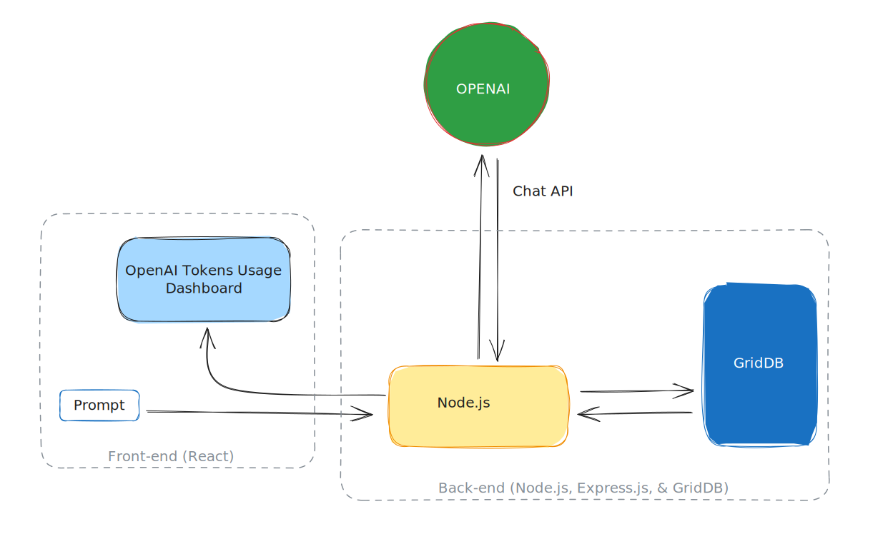

# Building an OpenAI API Tokens Usage Dashboard: A GridDB, Node.js, and React Approach

## Introduction

In the contemporary technological landscape, organizations often rely on sophisticated APIs, such as the OpenAI API, to drive their applications and services. These APIs allow systems to interact with advanced functionalities, including artificial intelligence and machine learning models, contributing significantly to enhancing the capabilities of the applications.

However, with the use of APIs comes the necessity of managing tokens, which essentially act as the "currency" for leveraging the API's features. In the context of the OpenAI API, tokens are used to determine the cost of an API call based on the amount of data processed.

While the OpenAI API provides a robust platform for implementing AI functionalities, managing the usage and associated costs of tokens can present a significant challenge. Over-usage can lead to unexpectedly high costs, and under-usage can mean underutilization of the allocated resources, neither of which is desirable for any organization.

This challenge has underscored the need for a system that can monitor and manage the usage of tokens in real time, providing valuable insights to organizations and enabling them to optimize the cost-efficiency of their API usage.

This document aims to delve into the process of building such a solution: an OpenAI API Tokens Usage Dashboard. The proposed dashboard is designed to leverage the strengths of GridDB for data management, Node.js for backend development, and React for front-end UI. Each of these technologies has been chosen for its specific strengths, which will be further detailed in the following sections.

The goal is to provide a comprehensive guide to understanding the problem, conceptualizing the solution, and implementing it effectively using the chosen technologies.

## Purpose of this Blog

The primary purpose of this document is to provide a thorough and systematic guide to building an OpenAI API Tokens Usage Dashboard using GridDB, Node.js, and React. This guide aims to empower developers to understand and address the challenge of managing token usage and its associated costs when using the OpenAI API.

The document is designed to:

1. Illustrate the challenges associated with managing token usage in the context of the OpenAI API, emphasizing the need for a real-time monitoring.

2. Present a detailed overview of the selected technologies—GridDB, Node.js, and React—and explain the rationale behind their selection.

3. Walk through the process of designing and implementing a tokens usage dashboard, from requirements analysis and architectural design to backend implementatioPurpose of the Document
   The primary purpose of this document is to provide a thorough and systematic guide to building an OpenAI API Tokens Usage Dashboard using GridDB, Node.js, and React. This guide aims to empower developers, project managers, and decision-makers to understand and address the challenge of managing token usage and its associated costs when using the OpenAI API.

The document is designed to:

1. Illustrate the challenges associated with managing token usage in the context of the OpenAI API, emphasizing the need for a real-time monitoring and management solution.

2. Present a detailed overview of the selected technologies—GridDB, Node.js, and React—and explain the rationale behind their selection.

3. Walk through the process of designing and implementing a tokens usage dashboard, from requirements analysis and architectural design to backend implementation and UI design.

4. Demonstrate the process of integrating the OpenAI API with the proposed system.

5. Highlight the testing, deployment for the developed dashboard.

By the end of the document, readers should have a comprehensive understanding of the problem at hand, the proposed solution, and the process of implementing the solution. It will equip them with the knowledge required to create and deploy an OpenAI API Tokens Usage Dashboard, ultimately leading to more efficient and cost-effective use of the OpenAI API.

## The Core Problem: Tokens Usage Cost

### Understanding OpenAI API Tokens

OpenAI's API uses tokens as the basic unit of work when processing requests. Essentially, tokens are chunks of text that the API reads and processes. They are not strictly equivalent to words, characters, or bytes but can be thought of as a measure of computational work.

The tokenization process, which breaks text into tokens, follows a specific algorithm used by the model. For example, in English, a token can be as short as one character or as long as one word, such as "a" or "apple". However, it's important to note that not all words are a single token. For instance, the word "chatbot" is a single token, but a word like "ChatGPT" might be broken into multiple tokens ("Chat", "##G", "##PT") based on how the model was trained to tokenize text.

The number of tokens in an API call significantly affects both the cost of the call and whether the call works at all. OpenAI charges per token, and the models have a maximum limit of tokens they can handle in a single call. For instance, as of September 2021, the gpt-3.5-turbo model has a maximum limit of 4096 tokens per call.

Understanding how to count tokens is crucial for controlling costs and ensuring your API calls work as intended. To manage costs and make efficient use of the OpenAI API, it is essential to understand how tokens work, how they affect the API calls, and how to count them accurately.

### The Cost Implications of Tokens Usage

The cost of using the OpenAI API is directly linked to the number of tokens processed during API calls. This pricing model holds true regardless of the type of API request being made, whether it's generating text, translating text, or performing any other task.

Each API call consumes a certain number of tokens, which include not only the tokens in the message you're asking the model to generate but also those in the prompt you provide, and those reserved for special instructions and formatting. Therefore, the total number of tokens used in an API call is a sum of tokens in the input prompt, the message generated, and special instructions.

### The Need for Monitoring and Managing Token Usage

Given the direct correlation between token usage and cost, as well as the impact on API call success, it's clear that monitoring and managing token usage is crucial when using OpenAI's API. There are several reasons why this is important:

1. **Budget Control**: By monitoring token usage, users can gain insights into how their usage patterns align with their budget. If token usage is high, users might need to adjust their utilization of the API to avoid overspending.

2. **Avoiding Failed API Calls**: Keeping track of token usage helps ensure that the total tokens in an API call do not exceed the model's maximum limit, thus preventing failed calls due to token overload. This is particularly important in applications where the reliability of the service is paramount.

3. **Optimizing API Usage**: Monitoring tokens can provide valuable insights into how efficiently the API is being used. For instance, if a large number of tokens are being used for control instructions or formatting, users might be able to refine their usage to reduce the token count without sacrificing the functionality of their application.

While it's clear that monitoring and managing token usage is essential, it can be challenging to do this effectively without the right tools and methodologies. That's where the concept of a Tokens Usage Dashboard comes into play. In the next section, we will explore the role and benefits of such a dashboard.

## The Proposed Solution: A Tokens Usage Dashboard

### Role and Benefits of a Tokens Usage Dashboard

A Tokens Usage Dashboard is a tool that allows users to monitor and manage the token usage of their OpenAI API calls. Such a dashboard plays a significant role in providing insights into token usage and supporting decision-making processes related to OpenAI API use. Here are some key benefits of implementing a Tokens Usage Dashboard:

1. Real-Time Monitoring: A Tokens Usage Dashboard can provide real-time updates on token usage. This allows users to keep a constant eye on their token consumption and react promptly to any unusual spikes or patterns that may occur.

2. Historical Data Analysis: The dashboard can store historical data on token usage, enabling users to perform trend analysis and identify patterns over time. This can be particularly useful for forecasting future token usage and planning budget accordingly.

3. Error Prevention: By monitoring the number of tokens used in each API call, the dashboard can help prevent errors due to exceeding the model's token limit. This can significantly enhance the reliability and performance of applications using the OpenAI API.

4. Ease of Use: A well-designed dashboard provides an easy-to-understand visual representation of token usage. This makes it accessible to both technical and non-technical users, promoting broader understanding and more effective decision-making.

In the next section, we will delve into why GridDB, Node.js, and React are chosen as the technologies to build this dashboard, and how they contribute to achieving these benefits.

## Why GridDB, Node.js, and React

The choice of technology is crucial in building an efficient and user-friendly Tokens Usage Dashboard. For this project, we have chosen **GridDB**, **Node.js**, and **React** as our primary technologies. Here's why:

### GridDB

[GridDB](https://griddb.net) is a highly scalable, in-memory NoSQL time series database optimized for IoT and Big Data. It's well-suited for storing and retrieving large amounts of structured data, making it a perfect fit for managing and tracking token usage data over time.

Key advantages include:

-   **Scalability**: GridDB provides excellent scalability, making it capable of handling a large volume of data with ease. This is crucial for monitoring token usage in real-time and storing historical data for trend analysis.
-   **Speed**: As an in-memory database, GridDB offers fast data processing capabilities. This ensures timely updates and quick responses, which are essential for real-time monitoring and immediate decision-making.
-   **Reliability**: GridDB's robust architecture ensures high availability and data consistency, providing a reliable foundation for the Tokens Usage Dashboard.

### Node.js

[Node.js](https://nodejs.org) is a powerful JavaScript runtime built on Chrome's V8 JavaScript engine. It's designed to build scalable network applications, making it a great choice for implementing the backend of our Tokens Usage Dashboard. The reasons for choosing Node.js include:

-   **Performance**: Node.js uses an event-driven, non-blocking I/O model, which makes it lightweight and efficient. This is ideal for data-intensive real-time applications that run across distributed devices, such as our Tokens Usage Dashboard.
-   **Community Support**: Node.js has a large and active community, which means a wealth of libraries and frameworks are available to speed up development and solve common problems.
-   **Integration**: Node.js can integrate seamlessly with GridDB and React, providing a unified JavaScript development environment across the stack.

-   **Cost**: The greatness of Node.js is, we can use JavaScript as the main language to develop a fully functional web application, from back-end to the client-side.

### React

[React](https://react.dev/) is a JavaScript library for building user interfaces, particularly single-page applications. It's maintained by Facebook and a community of individual developers and companies. The reasons for choosing React include:

-   **Component-Based**: React allows developers to build encapsulated components that manage their own state, then compose them to make complex UIs. This is perfect for building a dashboard with various interactive elements.
-   **Efficiency**: React creates an in-memory data structure cache, computes the resulting differences, and then updates the browser's displayed DOM efficiently. This results in a fast and responsive user interface.
-   **Popularity and Support**: React is widely used and has a strong community, making it a safe and reliable choice for building the front-end of the Tokens Usage Dashboard.

In combination, GridDB, Node.js, and React provide a powerful, efficient, and reliable stack for building our Tokens Usage Dashboard. The next section will dive deeper into each of these technologies and their role in the dashboard.

## Designing the Dashboard

### Structuring Our Solution

To effectively implement the OpenAI API Tokens Usage Dashboard, we need to establish a solid architectural design that ensures scalability, maintainability, and extensibility.

Here is an overview of the proposed architectural design for the solution:

1. **Client-Server Architecture**: The solution will follow a client-server architecture, where the client-side will be responsible for rendering the user interface and interacting with the user, while the server-side will handle data processing, storage, and communication with external APIs.

2. **Front-End (Client-Side)**:

    - **React**: The front-end will be developed using the React JavaScript library. React's component-based approach and virtual DOM will enable efficient rendering and ensure a responsive user interface.
    - **User Interface Components**: We will design and develop reusable UI components that will be used to create the dashboard interface. These components will handle user interactions, data visualization, and data filtering/search functionalities.

3. **Back-End (Server-Side)**:

    - **Node.js**: The back-end will be built using Node.js, a popular server-side JavaScript runtime. Node.js provides an event-driven, non-blocking I/O model, making it suitable for handling concurrent requests and real-time updates.
    - **Express.js**: We will use Express.js, a web application framework for Node.js, to simplify the development of RESTful APIs and handle routing, middleware, and request/response handling.
    - **GridDB**: GridDB, a high-performance in-memory database, will be utilized for data management and storage. GridDB's distributed architecture and scalability features make it well-suited for handling large volumes of token usage data.
    - **OpenAI API Integration**: The server-side code will integrate with the OpenAI API to retrieve token usage data and calculate the associated costs. This integration will involve making API requests, handling authentication, and parsing the response data.

4. **Data Flow**:
    - The client-side will communicate with the server-side through RESTful API endpoints exposed by the Node.js backend.
    - The server-side will interact with GridDB to store and retrieve token usage data efficiently.
    - The server-side will also interact with the OpenAI API to retrieve real-time token usage information and perform cost calculations.
    - The processed data will be sent back to the client-side as JSON responses, which will be used to update the dashboard's user interface.

A clear separation of concerns between the front-end and back-end, allows for easy integration with external APIs, and provides a solid foundation for future enhancements and additions to the dashboard.
